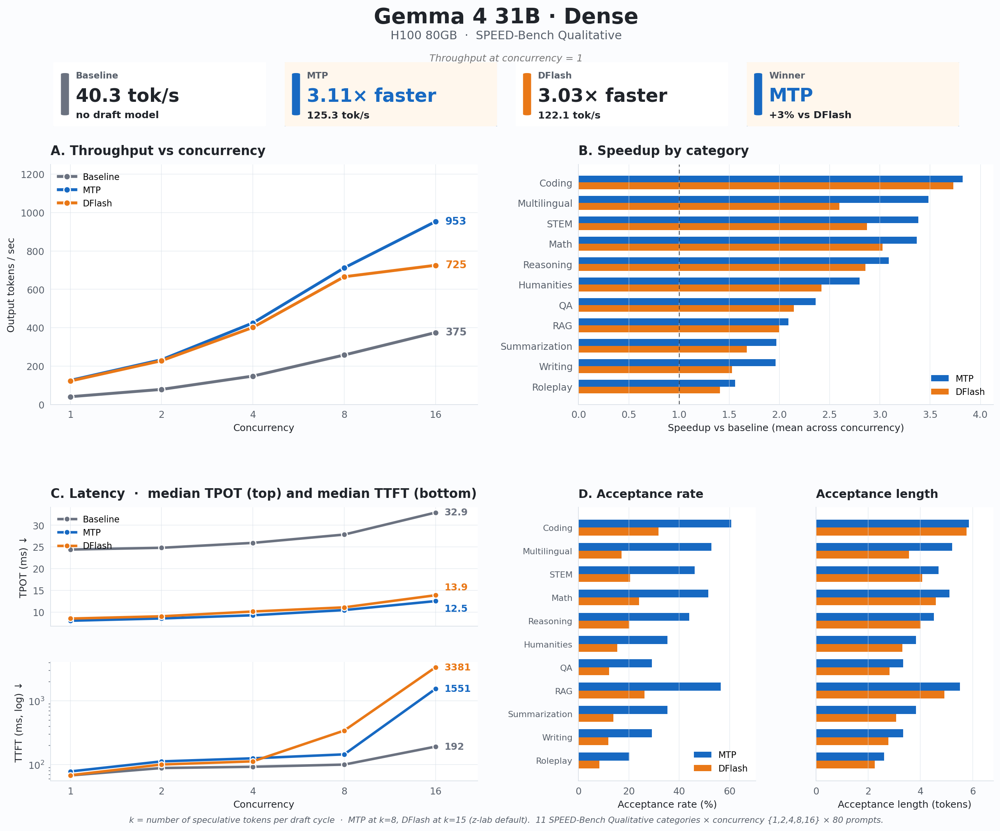
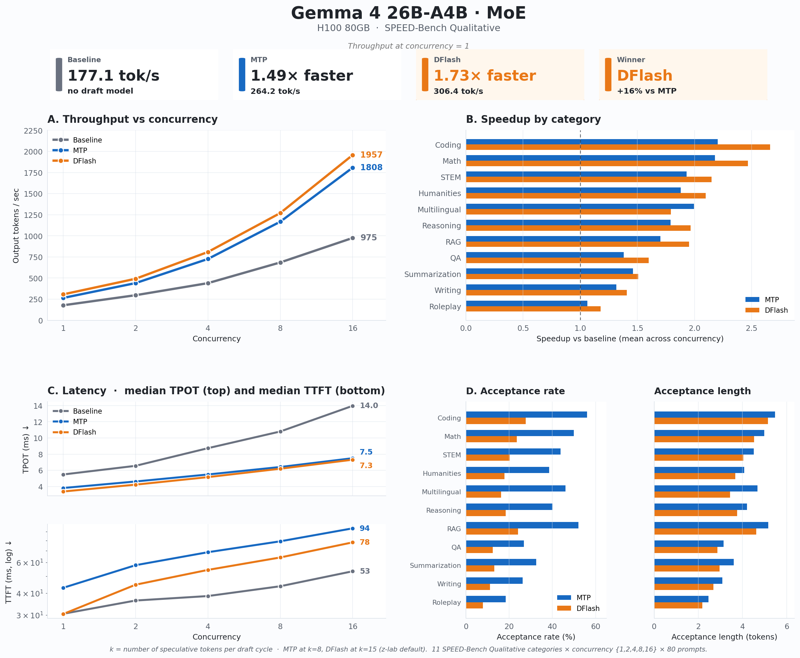
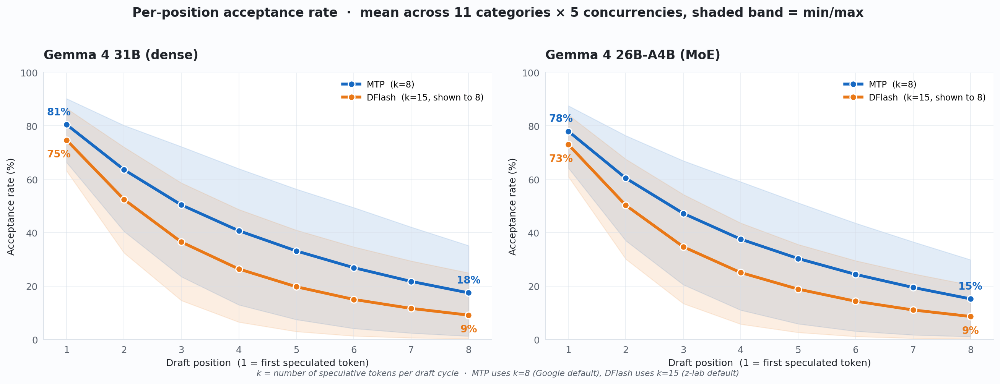

# Gemma 4 MTP vs DFlash Benchmark

This repo contains the scripts and notes behind our Gemma 4 speculative decoding benchmark on one JarvisLabs H100 80GB.

We compared three serving modes on the SPEED-Bench qualitative split:

- Baseline decoding with no draft model.
- MTP speculative decoding with Google's Gemma 4 assistant draft models.
- DFlash speculative decoding with z-lab's Gemma 4 DFlash draft models.

The benchmark covered two target models:

| Target model | MTP draft model | DFlash draft model |
|---|---|---|
| `google/gemma-4-31B-it` | `google/gemma-4-31B-it-assistant` | `z-lab/gemma-4-31B-it-DFlash` |
| `google/gemma-4-26B-A4B-it` | `google/gemma-4-26B-A4B-it-assistant` | `z-lab/gemma-4-26B-A4B-it-DFlash` |

## What Is In This Repo

- `scripts/serve_baseline.sh`: starts a baseline vLLM server.
- `scripts/serve_mtp.sh`: starts a vLLM server with MTP enabled.
- `scripts/serve_dflash.sh`: starts a vLLM server with DFlash enabled.
- `scripts/run_mtp_benchmarks.sh`: runs SPEED-Bench for baseline and MTP servers.
- `scripts/run_dflash_benchmarks.sh`: runs SPEED-Bench for DFlash servers.
- `docs/mtp_benchmark.md`: the actual baseline and MTP benchmark handoff doc used during the run.
- `docs/dflash_benchmark.md`: the actual DFlash benchmark handoff doc used during the run.
- `docs/mtp_goal.md` and `docs/dflash_goal.md`: the Codex Goal files used to run the benchmark variants sequentially.
- `figures/`: charts used in the blog post.

Before running anything, read the scripts and make sure the model names, dataset path, vLLM version, and DFlash install path still match the current upstream state. These scripts describe the setup we used for the blog post, not a universal benchmark harness.

## Main Settings

We kept the benchmark settings matched across baseline, MTP, and DFlash.

| Setting | Value |
|---|---|
| Hardware | 1x H100 80GB |
| Serving runtime | vLLM |
| Dataset | SPEED-Bench qualitative |
| Categories | 11 categories, 80 prompts each |
| Concurrency sweep | `1, 2, 4, 8, 16` |
| Max model length | `32768` |
| Max output tokens | `4096` |
| Server scheduler token cap | `--max-num-batched-tokens 4096` |
| Max concurrent sequences | `--max-num-seqs 16` |
| Sampling | `temperature=0` |
| Prefix caching | disabled |
| Gemma serving mode | `--language-model-only` |
| DFlash target attention | `triton_attn` |
| DFlash draft attention | `flash_attn` |

The two `4096` settings mean different things. `--max-num-batched-tokens 4096` is the vLLM server scheduler cap. `--speed-bench-output-len 4096` is the maximum number of output tokens requested by the benchmark client.

## DFlash vLLM Build

For Gemma 4 DFlash, we followed the official z-lab DFlash repository instructions and built vLLM from the Gemma 4 DFlash PR:

```bash
uv pip install -U --torch-backend=auto \
  "vllm @ git+https://github.com/vllm-project/vllm.git@refs/pull/41703/head"
```

## How We Ran The Benchmark

We first used Codex to brainstorm the benchmark shape: which Gemma 4 models to test, which SPEED-Bench split to use, what concurrency sweep to run, and which settings had to stay fixed across baseline, MTP, and DFlash.

That benchmark plan was captured in the handoff docs:

- `docs/mtp_benchmark.md` for baseline and MTP.
- `docs/dflash_benchmark.md` for DFlash.

After the plan was fixed, we prepared the runnable scripts for serving and benchmarking, then prepared Codex Goal files for the long benchmark run. Codex's [`/goal` feature](https://developers.openai.com/codex/use-cases/follow-goals) gives Codex a durable objective for long-running work, so it can keep working across turns toward a verifiable stopping condition.

- `docs/mtp_goal.md` for the baseline and MTP runs.
- `docs/dflash_goal.md` for the DFlash runs.

At that point, the benchmark itself was already locked down. The scripts, settings, and run order were fixed before the long run started. We could have run the same benchmark with scripts alone, but using Codex as an orchestration layer was useful: it monitored server readiness, moved through each variant in sequence, and kept the run aligned with the plan.

Codex then ran the benchmark variants sequentially. For each variant, it started the right vLLM server, waited for the server to become ready, ran the matching benchmark script, stopped the server, and moved to the next variant. The scripts saved detailed JSON artifacts under `artifacts/speed_bench/`. Those raw result files are not included in this repo.

## Run Order

Prepare the SPEED-Bench qualitative dataset under:

```text
data/speed_bench/
```

The benchmark scripts expect the dataset path above. They send requests to a vLLM server already running on `http://127.0.0.1:8000`; they do not start or stop the server.

Run each target model sequentially. Start one server, run the matching benchmark script, stop the server, then move to the next serving mode.

### 1. Baseline

```bash
MODEL=google/gemma-4-31B-it ./scripts/serve_baseline.sh
```

In another shell:

```bash
MODEL=google/gemma-4-31B-it \
VARIANT=gemma4_31b_baseline \
./scripts/run_mtp_benchmarks.sh
```

Repeat the same pattern for `google/gemma-4-26B-A4B-it` with `VARIANT=gemma4_26b_a4b_baseline`.

### 2. MTP

```bash
MODEL=google/gemma-4-31B-it \
DRAFT_MODEL=google/gemma-4-31B-it-assistant \
NUM_SPECULATIVE_TOKENS=8 \
./scripts/serve_mtp.sh
```

In another shell:

```bash
MODEL=google/gemma-4-31B-it \
VARIANT=gemma4_31b_mtp_nt8 \
DRAFT_MODEL=google/gemma-4-31B-it-assistant \
NUM_SPECULATIVE_TOKENS=8 \
./scripts/run_mtp_benchmarks.sh
```

Repeat the same pattern for `google/gemma-4-26B-A4B-it` with:

```text
DRAFT_MODEL=google/gemma-4-26B-A4B-it-assistant
VARIANT=gemma4_26b_a4b_mtp_nt8
```

### 3. DFlash

```bash
MODEL=google/gemma-4-31B-it \
DRAFT_MODEL=z-lab/gemma-4-31B-it-DFlash \
NUM_SPECULATIVE_TOKENS=15 \
./scripts/serve_dflash.sh
```

In another shell:

```bash
MODEL=google/gemma-4-31B-it \
VARIANT=gemma4_31b_dflash_nt15 \
DRAFT_MODEL=z-lab/gemma-4-31B-it-DFlash \
NUM_SPECULATIVE_TOKENS=15 \
./scripts/run_dflash_benchmarks.sh
```

Repeat the same pattern for `google/gemma-4-26B-A4B-it` with:

```text
DRAFT_MODEL=z-lab/gemma-4-26B-A4B-it-DFlash
VARIANT=gemma4_26b_a4b_dflash_nt15
```

## Figures

### Gemma 4 31B Dense



### Gemma 4 26B-A4B MoE



### Per-Position Acceptance



## Related Reading

- [Gemma 4 MTP announcement](https://blog.google/innovation-and-ai/technology/developers-tools/multi-token-prediction-gemma-4/)
- [z-lab DFlash repository](https://github.com/z-lab/dflash)
- [SPEED-Bench dataset](https://huggingface.co/datasets/nvidia/SPEED-Bench)
- [vLLM speculative decoding docs](https://docs.vllm.ai/en/latest/features/speculative_decoding/)
